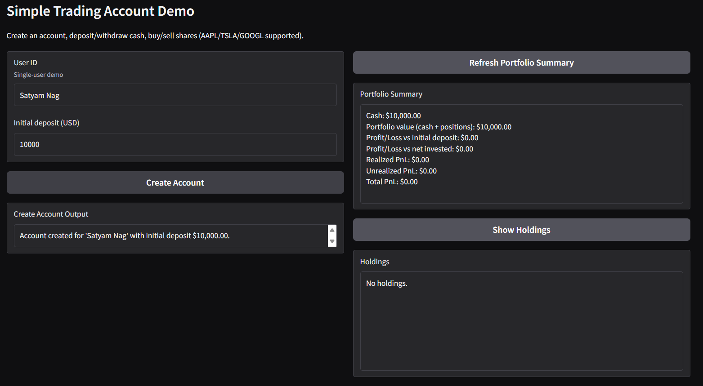
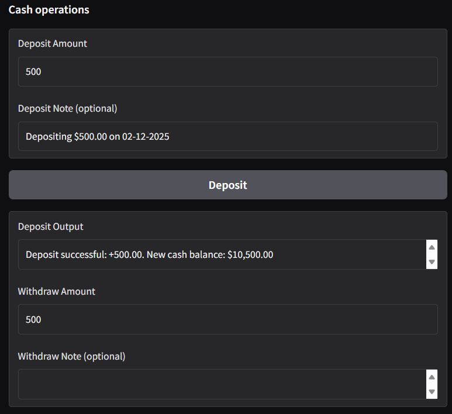
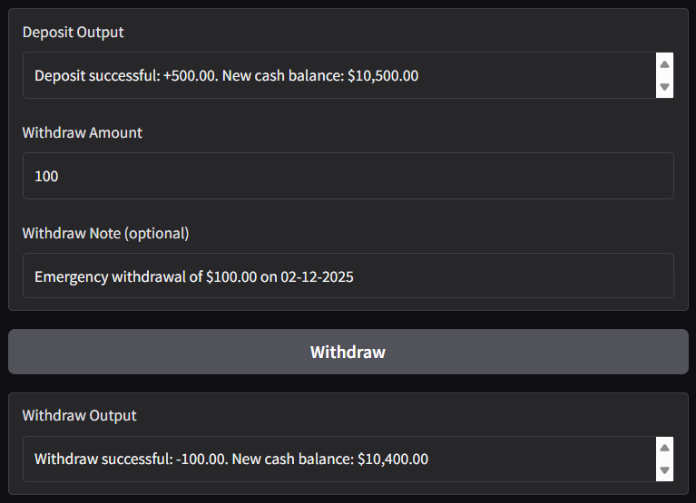
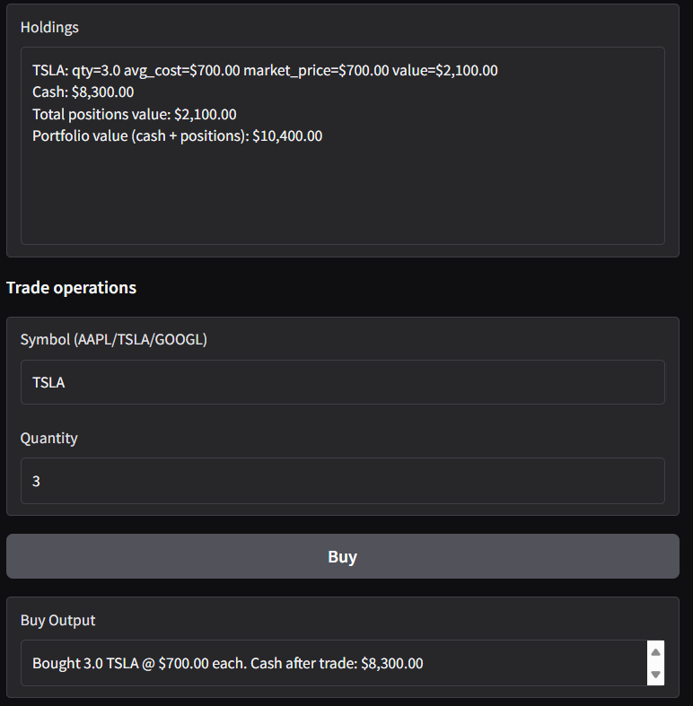
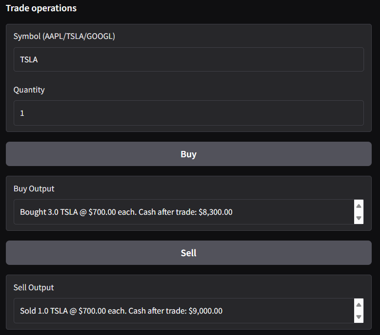
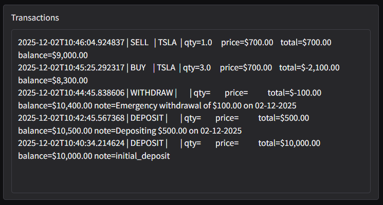

# CodeCrew: AI-Powered Python Engineering Team

**CodeCrew** is an AI-driven Python development team built with [CrewAI](https://crewai.com/), featuring specialized roles:  
- **Lead Engineer**  
- **Backend Engineer**
- **Frontend Engineer**
- **Test Engineer**

This collaborative crew excels at tackling Python-based coding tasks. In this project, we've developed a **simple Account Management System** for a **Trading Simulation Platform**.  

## Key Features with Screenshots of the Account Management System the Engineering team is created:
- **Creating Account entering User ID and Initial Deposit**

- **Cash Deposit**

- **Cash Withdrawal**

- **Buying Shares**

- **Selling Shares**

- **Portfolio Summary and Holdings**

- **List of all Transactions**
